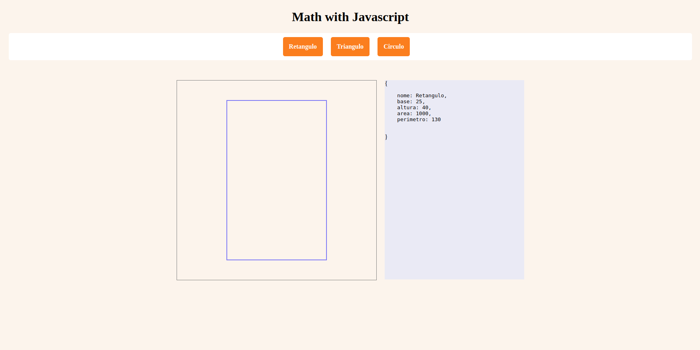

# Geometry Drawing Tool

This is a web-based application that allows users to create and visualize geometric shapes such as rectangles, triangles, and circles. It provides a simple and intuitive interface for inputting the dimensions of the shapes and generates dynamic visual representations of the shapes on a canvas.

### Key Features:

- Creation of rectangles by specifying the base and height.
- Drawing of triangles with customizable side lengths and types (equilateral, isosceles, or scalene).
- Generation of circles by specifying the radius.
- Visual representation of the shapes on a canvas with adjustable dimensions.
- Display of shape properties such as area, perimeter, height, circumference.

Taller Práctico de JavaScript: Matemáticas y Estadística Básica
`Platzi`

---

# Ferramenta de Desenho de Geometria

Este é um aplicativo baseado na web que permite aos usuários criar e visualizar formas geométricas, como retângulos, triângulos e círculos. Ele oferece uma interface simples e intuitiva para inserir as dimensões das formas e gera representações visuais dinâmicas das formas em um canvas.

### Principais Recursos:

- Criação de retângulos especificando a base e a altura.
- Desenho de triângulos com comprimentos laterais personalizáveis e tipos (equilátero, isósceles ou escaleno).
- Geração de círculos especificando o raio.
- Representação visual das formas em um canvas com dimensões ajustáveis.
- Exibição das propriedades das formas, como área, perímetro, altura, circunferência.

Taller Práctico de JavaScript: Matemáticas y Estadística Básica
`Platzi`